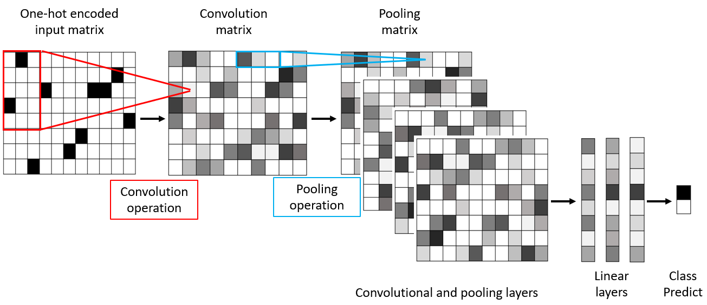
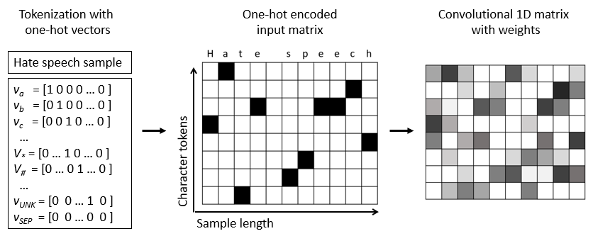
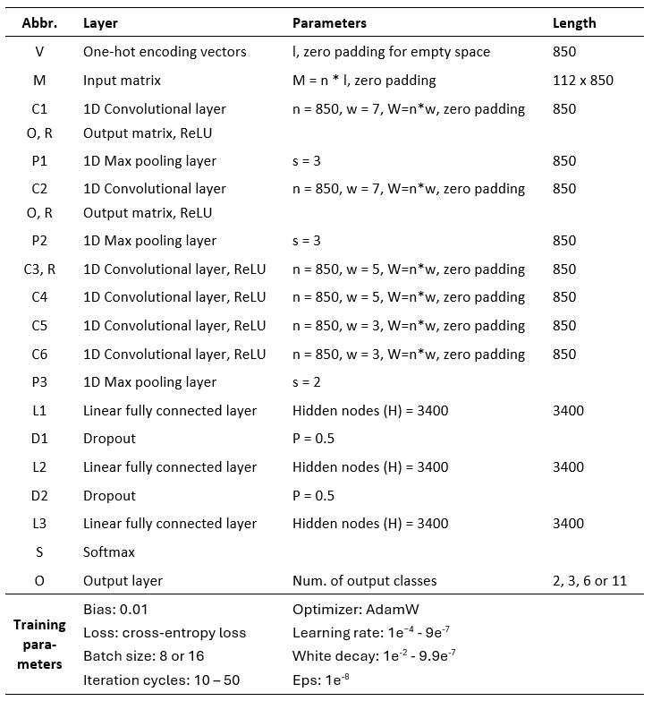

# Character Level CNN (CharCNN) based Sentiment and Hate Speech (HS) Classification Models

Character Level CNN (CharCNN) based sentiment and hate speech (HS) classification models use modified version of original CharCNN method.

The scripts were created and published by Merja Kreivi-Kauppinen, and
are part of research work carried in University of Oulu in 2020-2023.

The study is reported on (Master’s Thesis) research paper - 
Merja Kreivi-Kauppinen (2024) Hate Speech Detection of Dialectal, Granular and Urban Finnish. 
University of Oulu, Degree Programme in Computer Science and Engineering. Master’s Thesis.

## Introduction

Figure. The CharCNN model.

## Original method and references

Original 'Character-level convolutional networks for text classification' -method has been published by Zhang, Zhao, & LeCun (2015).

 - Zhang, X., Zhao, J., & LeCun, Y. (2015). Character-level convolutional networks for text classification. Advances in neural information processing systems, 28.
 - Koomsubha, T., & Vateekul, P. (2017). A character-level convolutional neural network with dynamic input length for Thai text categorization. In 2017 9th International Conference on Knowledge and Smart Technology, (2017, February), 101-105. IEEE.
 - Jacovi, A., Shalom, O., & Goldberg, Y. (2018). Understanding convolutional neural networks for text classification. arXiv preprint arXiv:1809.08037.

### Hints and tips available at GitHub and Web:

- https://github.com/BrambleXu/nlp-beginner-guide-keras/blob/f2fdfdd20e73ae16208b3ac63962a769fac51065/char-level-cnn/notebooks/char-level-text-preprocess-with-keras-summary.ipynb

- https://github.com/BrambleXu/nlp-beginner-guide-keras/blob/f2fdfdd20e73ae16208b3ac63962a769fac51065/char-level-cnn/notebooks/char-cnn-zhang-with-keras-pipeline.ipynb

- Andrew Fogarty http://seekinginference.com/applied_nlp/CharCNN.html

- https://github.com/castorini/hedwig

## Character CNN based Classification

High granulation and noise rate of common social media content makes the task of pattern analysis of HSD a highly complex practice, where one-hot encoding is the most basic way to turn a text sample into a token vector. 

One-hot encoding of text samples can be done at the character level. Evaluated character level classification experiments applied original fixed length character-based CNN (CharCNN) models.

CharCNN classification models use one-hot encoding vectors as an input for the network. CharCNN models extract every character in text on feature vector, and as such, text features are not limited to alphabets, but also numbers, punctuations, and character-level symbols and combinations can be used as features. 

Designed CNN algorithm included one-dimensional (1D) convolution kernels which are convoluted with the input matrix on a convolution layer. The convolution operation builds up the characteristic graph of input matrix and local features. The aim of character-based convolution operation is to stepwise capture the local relationships between words, characters, and symbols. The convolution kernel performs convolution operation on the input matrix while sliding a defined window step-by-step thorough the matrix. With sliding windows, convolutions can learn word morphologies, non-separated words, and misspelled words without any knowledge of the language.

## Characters

The input matrixes of CharCNN models were designed for 112 characters. The same alphabet, numeric, and special characters as on the original design were used, but some European alphabets (åäöäöåéíß), uppercases, special characters, and special tokens were added.

 - Abcdefghijklmnopqrstuvwxyzäöåéíß 0123456789
 - ABCDEFGHIJKLMNOPQRSTUVWXYZÄÖÅÉÍ
 - !"#$%&\'()*+,./:;<=>?@[\\]^_`{|}~´”€|£ 
 - UNK PAD

## One-hot vectors

A one-hot vector is a vector where only one position has value one for a character, and remaining positions have a value zero. 
The position of value 1 in the vector indicates a represented character. 
The v(a) vector represents a character ‘a’, v(b) vector represents a character ‘b’, and the rest of the characters are created on similar manner. Empty space is represented by an empty vector v(sep) = [ 0 0 … 0 0 ].

Figure. Character level one-hot vectors.

## Convolutional and linear layers

Each character in the sample were encoded using one-hot vector xi ∈ {0, 1}112. Sequence of one-hot vectors of text sample create the starting matrix x1, .., 850 ∈ {0, 1}850x112. The dimension of an input matrix (M) is n x l, whereas n is the number of input features (n=112), l is the length of text sample (l=850), padding (PAD) was used for empty space, and unknown token (UNK) was used for unknown tokens. Since an input matrix had a fixed length of 850 characters, also every convolutional layer had 850 features, including the first input matrix. The first convolutional layer (C1) was created by adding weight to the input matrix (M). The embedding layer was the feature extraction layer, where the vectors initialized the weights on every unique character randomly, and the initial weight was always same for one character.

The ReLU function was used to provide non-linearity layer after every convolution layer, and dropout modules were placed between the fully connected layers for regularization purposes.  All experiments used the same basic CharCNN model, where the AdamW optimizer was used to optimize the parameters, the softmax function was used to classify the result predictions, the cross-entropy loss was used as loss function. 

The number of output units for the last layer predicts was determined by the classification problem.

## Demonstration

CharCNN model was evaluated with unprocessed ‘raw’ samples, manually processed ‘correct’ samples, and ‘all data’ set which contained both ‘raw’ and ‘correct’ samples. 

As on a character-level models text samples are not necessary to be preprocessed before embeddings creation phase, the only pre-processing steps were the removal of duplicates and limit the string length into 850 characters. The effect of lemmatization on classification results was tested by lemmatizing samples with Spacy+Voikko method, and the effect of emojis was tested by changing emojis into Unicode symbols with Emoji library.

HS binary, SA trinary, or SA polarity sentiment lexicons including labeled words with sentiment values (created for AFINN and SentiStrength classification methods) were added to dataset before splitting of data to train, validate, and test data. HS strength classification experiments did not include additional sentiment dataset. From every experiment wise dataset, 90% of the data was used as training data, 10% as validating data, and the other 10% was used as testing data.

Training steps used AdamW optimizer with batch size 8 or 16, and variable learning rates. Either the eps term was added to the optimizer to improve numerical stability, or white decay coefficient was added for regularization to avoid over-fitting.

The cross-entropy loss was used as the loss function, and the model with the lowest validation loss was saved as the best iteration of the network. The saved model weights were returned as the best weights to calculate evaluation results on test data. 

The experimental training parameters were adjusted for each classifier, as studied label sets achieved the optimal classification effect when the parameters are adopted accordingly. The CharCNN model design and training parameters are shown in Table below. 

Table. An architecture and experimental parameter settings of CharCNN models.

