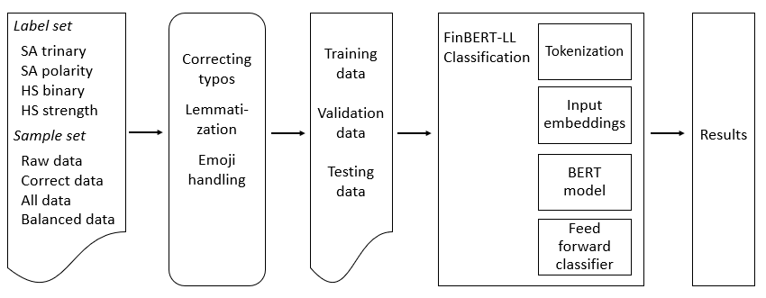
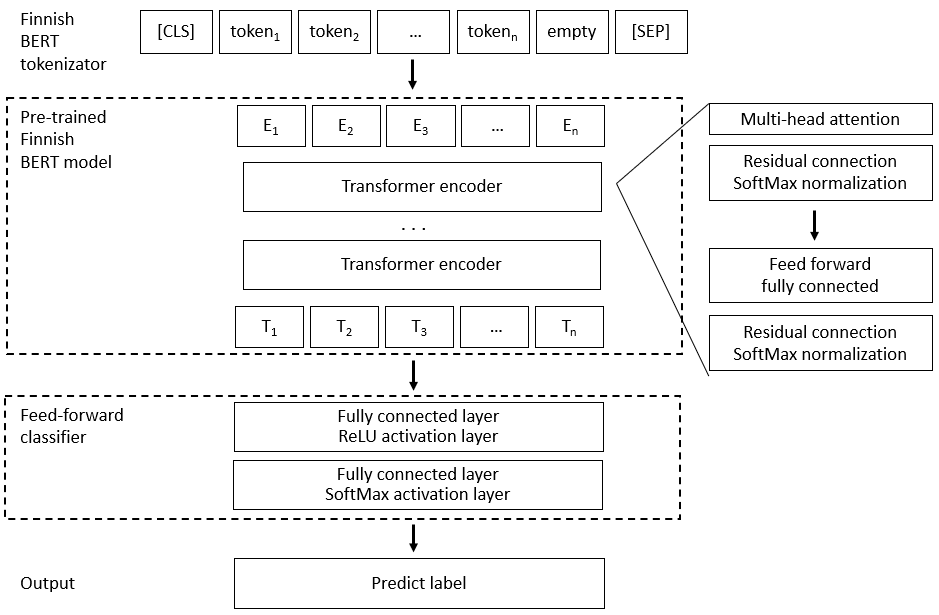
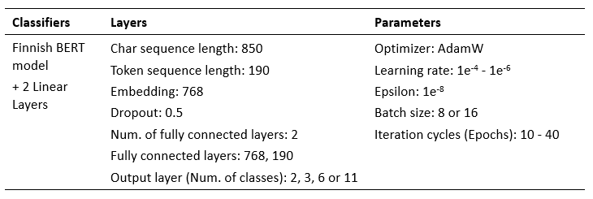

# BERT Transformers based Sentiment and Hate Speech (HS) Classification Models

BERT based sentiment analysis (SA) and hate speech detection (HSD) classifiers were built by using pre-trained BERT language model and transfer learning methods of the downloadable Transformers library published by Hugging Face. 

The scripts were created and published by Merja Kreivi-Kauppinen, and
are part of research work carried in University of Oulu in 2020-2023.

The study is reported on (Master’s Thesis) research paper - 
Merja Kreivi-Kauppinen (2024) Hate Speech Detection of Dialectal, Granular and Urban Finnish. 
University of Oulu, Degree Programme in Computer Science and Engineering. Master’s Thesis.

## Introduction

The main structure of combined BERT-NN model is divided into BERT model, linear layers of feedforward classifier, and classification output layer which provides final predicts. The input text is transformed into a vector by BERT tokenizator and BERT model provides trained feature weights, and the combination of linear and activation layers is used to extract local features. The basic process structure of a BERT-NN model-based classifiers is shown in Figure below.

SA and HSD classification experiments were carried out with pre-trained Finnish BERT model (FinBERT). The SoftMax classifier is used to classify the predict of the sample.

Figure. The process structure of BERT-LL classifier.

## References

 - Virtanen, A., Kanerva, J., Ilo, R., Luoma, J., Luotolahti, J., Salakoski, T., Ginter, F., & Pyysalo, S. (2019). Multilingual is not enough: BERT for Finnish. arXiv preprint arXiv:1912.07076. 
 - Huang, P., Zhu, H., Zheng, L., & Wang, Y. (2021). Text sentiment analysis based on Bert and Convolutional Neural Networks. In 2021 5th International Conference on Natural Language Processing and Information Retrieval, 2021, December, 1-7.
 - Wang, X., & He, N. (2022). Multi-feature Microblog Sentiment Analysis based on BERT-AttBiGRU model. In Proceedings of the 3rd Asia-Pacific Conference on Image Processing, Electronics and Computers, 2022, April, 967-974.
 - Jacovi, A., Shalom, O., & Goldberg, Y. (2018). Understanding convolutional neural networks for text classification. arXiv preprint arXiv:1809.08037.

## Design & Layers

Designed BERT classifiers were built on top of the pre-trained FinBERT model. The BERT model consists of twelve transformer layers, where each transformer layer is fed with a vector of embeddings, and each transformer layer produces the same number of embeddings with the same hidden size dimension on the output layer. The output of the final transformer layer fed the feature sequence of tokens to the feed-forward classifier, where two fully connected layers set the basic structure of the classification layers. The first layer of linear layers (LL) extracted the last hidden layer of the tokens, and the feature vectors are merged to collect the most characteristic features of the sample. The purpose of full connection layers was to facilitate the output of the net, where two dropout layers were set for regularization purposes. The output of the last classifier layer was fed to SoftMax function to classify the sample features into predicted classes. The cross-entropy loss (CE Loss) was used to calculate probability distribution over classes and to provide the final predicts of classification labels. 

Figure. The BERT-LL classifiers were built on pre-trained FinBERT model.

The last linear layer transforms the feature vector into the output category. For example, the HS category is usually classified as binary between ‘HS’ and ‘no HS’ labels. 
The number of output units for the last layer was defined according to the classification problem. 
For example, the HS category was classified as binary between ‘HS’ and ‘no HS’ labels and the number of output units was two (2), 
for six-class classification task of ‘HS strength’ category output was six, and for eleven-class classification problem of ‘SA polarity’ category output was eleven. 

## Pretrained BERT model for cased Finnish

FinBERT is included in HuggingFace transformers library. 
The pretrained FinBert model was downloaded as (FinBERT =) "TurkuNLP/bert-base-finnish-cased-v1".
FinBert-based tokenizer was set with "TurkuNLP/bert-base-finnish-cased-v1" as BERT_TOKENIZER = BertTokenizer.from_pretrained(FinBERT).

## Preprocessing

Text samples were not preprocessed before embeddings creation, as the only preprocess step was the removal of duplicates and to limit the sample string length into 850 or 300 characters. The effect of lemmatization on classification results was tested by lemmatizing samples with Finnish Spacy+Voikko method. The effect of emojis was tested by adding emojis and new alphabets and special characters into BERT model’s token list before training steps.

## Datasets

BERT-LL classification models were tested with unprocessed ‘raw’ samples, manually processed ‘correct’ samples, all samples dataset (‘all data’) which contained both ‘raw’ and ‘correct’ samples, and balanced dataset. Because of lack of data, HS binary, SA trinary, or SA polarity sentiment lexicons including labeled words with sentiment values (built up for AFINN and SentiStrength classification methods) were added to dataset before splitting to train, validate, and test data to boost the training results. Classification experiments with HS strength labels and balanced dataset did not include any additional sentiment lexicon dataset. From every experiment wise dataset, 90% of the data was used as training data, 10% as validating data, and 10% as testing data. 

## Demonstration

The pre-trained FinBERT model was not frozen before training phase, as the aim was to let the NN learn new weights – especially on newly added tokens.

On training steps, the AdamW optimizer was used to optimize the parameters with batch size eight or sixteen, variable learning rates between 1e−4 - 8e−6, and variable iteration cycles. Either the eps term (1e-8) was added to the optimizer to improve numerical stability, or white decay coefficient was added for regularization to avoid over-fitting. The cross-entropy loss was used as the loss function for all the models. 

All experiments used the same FinBERT-LL model, where the training parameters were adjusted according to the classifier, as studied sample data and label sets achieved the optimal classification effect when the parameters are adopted accordingly. The model design and parameters are shown in Table below.

Table. The layer and parameter settings of Finnish BERT-LL models.

## Performance values

The model with the lowest validation loss was saved as the best iteration of the network, 
as the best model is most likely one associated with a low validation loss. 
The saved model weights were returned as the best weights to calculate evaluation results on test data. 

Experimental models were evaluated with test data by measuring performance with accuracy, F1, precision, recall, FPR and TPR values.
