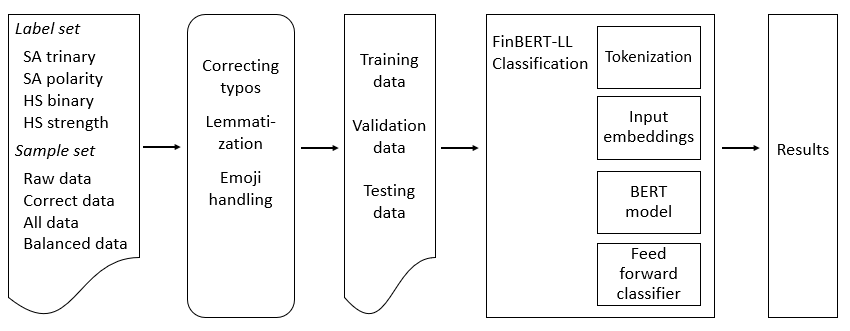

# Hate Speech and Sentiment Classification Experiments

## Introduction 

The design and development of 'Hate Speech Annotation Framework' (HS Annotation Framework) 
is based on the research work reported on (Master’s Thesis) research paper - 

Merja Kreivi-Kauppinen (2024) Hate Speech Detection of Dialectal, Granular and Urban Finnish. University of Oulu, Degree Programme in Computer Science and Engineering. Master’s Thesis, 111 p.

Figure. SA and HSD was studied by sentiment, polarity, HS binary, and HS strength classification methods..

The experiments evaluate and expand sentiment analysis (SA) and hate speech detection (HSD) methods to urban, granular and dialectal language types of unstructured and semi-structured text data. 

The experiments applied comparative sentiment and hate speech (HS) classification algorithms on Finnish social media samples. 
Four basic and simple ML models were designed for classification of trinary sentiment, multilabel polarization, 
classification of binary HS predictions and multilabel HS strength dimension predictions (Figure below). 

## Pre-processing and Finnish Spacy+Voikko method

Experiments evaluated Finnish NLP methods on text preprocessing and embedding steps. 

Experiments including preprocessing steps tested the effect of lemmatization with Finnish Spacy+Voikko method to classification results.
When classifications were evaluated for lemmatized samples, the lemmatization was carried out with experimental Finnish Voikko method 
designed for Spacy (Spacy version 3.5.0) using large Finnish language model 'fi_core_news_lg' the source of tokens. 
Experimental Finnish Spacy+Voikko model was chosen for lemmatization because it was available for Python on Windows.

## Datasets

Classification experiments tested new datasets of SA sentiment, SA polarity, HS binary and HS strength labels. 
HS target, topic and form categories (of the dataset) were not tested in classification experiments.  

Only Finnish samples were examined, whereas content containing other languages than Finnish were discarded from the data during the annotation process. 
Different setups of text processing were compared, 
therefore the samples were classified either as unprocessed ‘raw’ text samples, which did not contain any modification or cleaning of the content, 
or as manually processed (‘correct’) text samples, where typos and granulated samples were changed into more correct form grammatically.

## Evaluation metrics

Results of applied models were evaluated and compared with common performance metrics 
accuracy (Acc), precision (Pre), recall (Rec), F1-score (F1), true positive rate (TPR) and false positive rate (FPR), 
as the goal was to ensure that the best models have low false positive rate (FPR).

## SA and HSD Classification Experiments with AFINN and SentiStrength

Figure. The classification processes of lexicon-based AFINN and SentiStrength models.

<li>   AFINN-Classification -folder
<li>   SentiStrength-Classification -folder

Preprocessing phase before AFINN and SentiStrength scoring included lowercasing and tokenization steps, 
where tokenization was carried out with NLTK ‘whitespace’ or ‘casual’ tokenizer. 

## SA and HSD Classification Experiments with Finnish BERT (FinBERT)

Figure. The process structure of BERT-LL classifier.

<li>   FinBERT-Classification -folder

On BERT based classifiers text samples were tokenized with pre-trained ‘TurkuNLP/bert-base-finnish-cased-v1’ language model. 
Few experiments were carried out with extended BERT model, where some special characters and emojis, where added on the list of tokens of pretrained BERT model. 
Extended BERT model was able to feed tokens for emojis and special characters, 
which enabled emojis and emoticons to be provided into the training and classification processes.

## SA and HSD Classification Experiments with Character Level CNN (CharCNN)

Figure. The basic NN structure of CharCNN model.

<li>   CharCNN-Classification -folder

On CharCNN classifiers text samples were embedded into one-hot feature vectors. 
Extended character list enabled emoticons to be fed into the training and classification process. 
UTF-8 encoded emojis were converted to Unicode blocks (like U1F642) as Unicode string symbols provided individual tokens 
that were possible to be fed into the training and classification processes of CharCNN models.
